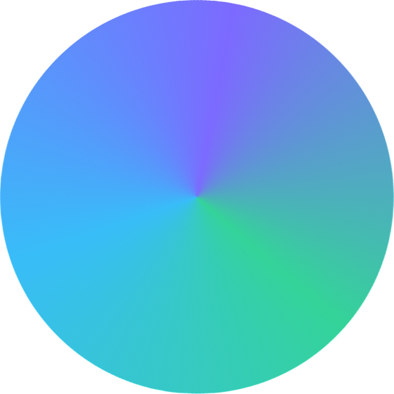

  

---

  
  
  

---

# Vortex Solver

Vortex Solver is a **free, browser-native AI solver** that works on any subject — built to run entirely in your browser with no setup, no API key, and no server required. Powered by [Pollinations AI](https://pollinations.ai) and [Tesseract.js](https://github.com/naptha/tesseract.js).

> Why pay for a tutor when you can have a *vortex* of knowledge?

  
<b>💡 Why free and open-source?</b>

AI tutoring tools are increasingly locked behind subscriptions and paywalls. Vortex Solver exists to keep smart, step-by-step problem solving **accessible to everyone** — students, developers, and curious minds alike.

By keeping it open-source:
- Anyone can audit exactly what it does
- Developers can embed it in their own projects
- The community can improve the templates and prompts
- ⭐ **No one pays to learn**

  
<b>❓ Can I use this in my own project?</b>

**Yes.** That's the whole point. Drop `vortex-core.js` into any page and you have a full reasoning engine in two lines of JavaScript. See the [API docs](https://stuffzez.github.io/Vortex-Solver/#docs) for the full interface.

The code is [GPL-3.0 licensed](https://www.gnu.org/licenses/gpl-3.0.html) — use it freely, but anything that uses it must also be open-source. Give credit where it's due.

  
<b>✦ Subject Templates</b>

| Icon | Template | Covers |
|------|----------|--------|
| ∑ | Mathematics | Algebra, calculus, geometry, statistics |
| ⚗ | Science | Physics, chemistry, biology, astronomy |
| </> | Code & CS | Debugging, algorithms, explanation, generation |
| ⌛ | History | Events, causes, timelines, significance |
| ✍ | Grammar & Writing | Proofreading, style, grammar rules |
| ◈ | Logic & Puzzles | Deduction, proofs, sequences, lateral thinking |
| £ | Finance | Interest, ROI, mortgages, break-even |
| 語 | Languages | Translation, etymology, conjugation |
| ¶ | Essay & Analysis | Thesis, structure, argument, literary analysis |
| ✦ | Auto-detect | Identifies the subject automatically |

  
<b>🔗 Links</b>

- 📖 [API Docs & Implementation Guide](https://stuffzez.github.io/Vortex-Solver/#docs)
- 🐛 [Report a Bug](https://github.com/StuffzEZ/Vortex-Solver/issues)
- 💬 [Discussions](https://github.com/StuffzEZ/Vortex-Solver/discussions)

---

> [!NOTE]
> Vortex Solver sends requests to [https://text.pollinations.ai](https://text.pollinations.ai) for all AI reasoning. No data is stored or logged by this project.
> Image OCR is handled entirely in-browser by Tesseract.js — your images never leave your device.

> Vortex Solver README.md  
> A free, browser-native AI solver for any subject
>
> Copyright (C) 2026 StuffzEZ  
> https://github.com/StuffzEZ/Vortex-Solver
>
> This program is free software: you can redistribute it and/or modify
> it under the terms of the GNU General Public License as published by
> the Free Software Foundation, either version 3 of the License, or
> (at your option) any later version.
>
> This program is distributed in the hope that it will be useful,
> but WITHOUT ANY WARRANTY; without even the implied warranty of
> MERCHANTABILITY or FITNESS FOR A PARTICULAR PURPOSE. See the
> GNU General Public License for more details.
>
> You should have received a copy of the GNU General Public License
> along with this program. If not, see <https://www.gnu.org/licenses>.

This project was made with the use of generative AI.
